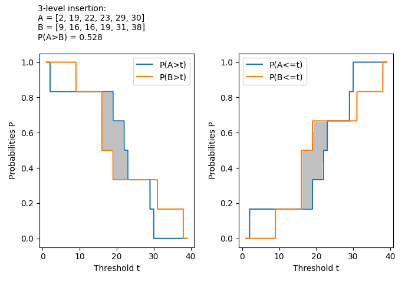
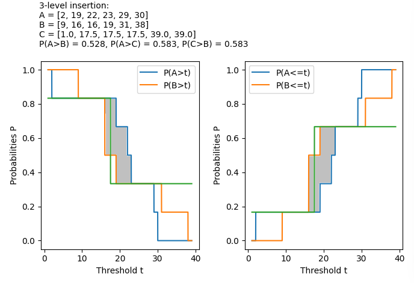

# Construction of N intransitive M-sided dice (3-level insertion)

## Conjecture

For any fixed values of $N$ and $M$ with $N,M≥3$, there exist sets of $N$ $M$-sided dice $D_i$ with $1≤i≤N$ forming a strict intransitive cycle, such that $P(D_1>D_2) > 0.5, ..., P(D_{N-1}>D_N) > 0.5, P(D_N>D_1) > 0.5$, or $P(D_N>D_{N-1}) > 0.5, ..., P(D_2>D_1) > 0.5, P(D_1>D_N) > 0.5$.

For $N=M$ and $M≥3$, we can generate a set of $N$ $M$-sided dice e.g. using Muñoz-Perera's formula [^1] or Clary-Leininger dice [^4].

For $N>M$ and $M≥3$, we can generate these intransitive dice using the following algorithm (3-level insertion):
1. Start with a known set of $M$ intransitive $M$-sided dice with $P(D_M>D_{M-1}) > 0.5, ..., P(D_2>D_1) > 0.5, P(D_1>D_M) > 0.5$. The initial set is given e.g. by Muñoz-Perera's formula for $M≥3$ [^1] Any intransitive $M$-cycle seed suffices; Muñoz-Perera dice [^1] or Clary-Leininger dice [^4] are convenient but not required.
2. Construct a new die $D_j$ with $P(D_i>D_j) > 0.5$ and $P(D_j>D_{i-1}) > 0.5$.
3. Insert the new die $D_j$ in the cycle between $D_i$ and $D_{i-1}$.
4. Repeat steps 2 and 3 until there are $N$ intransitive dice.

Given two $M$-sided dice $A$ and $B$ with $P(A>B) > 0.5$, a new $M$-sided die $C$ with $P(A>C) > 0.5$ and $P(C>B) > 0.5$ can be  constructed from 3 different levels (face values): 
   * a low value $L < min(A, B)$,
   * a high value $H > max(A, B)$,
   * a threshold value $T$ computed from the probability distribution of $A$ and $B$,

To convert real face values to integer, we multiply all values by a constant factor greater than one and round down the result: $x ↦ ⌊ax⌋$. If the factor is large enough, the resulting integer dice will still hold $P(A>C) > 0.5$ and $P(C>B) > 0.5$.

This yields a strict intransitive cycle of length $N$, i.e. the result is a set of $N$ $M$-sided dice with at least one intransitive cycle of length $N$.

## Proof of the conjecture

The conjecture matches Alex Schaefers theorem proven in [Balanced Non-Transitive Dice II: Tournaments](https://arxiv.org/pdf/1706.08986): [^2]

> Theorem 2.1. For any n,m ≥ 3, there exists a non-transitive set of n balanced m-sided dice.  
> We prove that sets of n such (non-transitive) m-sided dice exist for all n,m ≥ 3.  
> Proof of Theorem 2.1. We proceed by induction. Our base case, with three dice (n = 3), is done (for arbitrary number of sides m ≥ 3, see [^7]). So assume we have a set of k balanced non-transitive m-sided dice, A1,...,Ak. Create a new die Ak+1 whose entries are those of Ak, each shifted down by some ǫ < 1. The set of dice A1,...,Ak+1 could be relabeled linearly from [(k +1)m], which would complete the proof if the condition of balance were omitted from the theorem (we could then also omit it from the proof). But, by shifting the entries of Ak+1 up by ǫ rather than down, we alter P(Ak ≻ Ak+1) while keeping P(Ak+1 ≻ A1) the same (the victorious probability we started with). This recovers the condition of balance.

It also matches the [central limit theorem for intransitive dice](https://arxiv.org/pdf/2310.17083) by Luis G. Coelho, Tertuliano Franco, Lael V. Lima, João P.C. de Paula, João V.A. Pimenta, Guilherme L.F. Silva and Daniel Ungaretti: [^3]

> Theorem 1. Consider dice whose face entries are positive integers. For every ℓ ≥ 3 and n ≥ 3 there exists a no-tie collection of ℓ honest n-sided dice which is intransitive.

## Proof sketch of the 3-level algorithm

1. An $M$-sided die $A$ has face values $A[1], ..., A[M]$. On a roll, each face occurs with probability $1/M$. Thus for the induced random variable $X$, $P(X∈V(A)) = 1$ and $P(X=A[m]) = 1/M$ for each m.

2. Let $A$ be a M-sided die with face values $A[m]$, $1 ≤ m ≤ M$. We use $cnt(A > t)$ and $cnt(A < t)$ as shortcuts for the number of values above resp. below a threshold $t$, i.e. $cnt$ gives the number of values with property $A[m] > t$ resp.  $A[m] < t$:
   * $cnt(A > t) = \sum_{m=1}^M{H(A[m] > t)}$
   * $cnt(A ≤ t) = \sum_{m=1}^M{H(A[m] ≤ t)}$

   where the [Heaviside step function](https://en.wikipedia.org/wiki/Heaviside_step_function) (indicator function) is defined by $H(x) = 1$ if $x$ is true and $H(x) = 0$ otherwise.

3. The probability that die $A$ rolls a value above or below a given threshold $t$ is given by the distribution functions:
   * $F_A(t) = P(A ≤ t) := cnt(A ≤ t) / M$ (cumulative distribution function)
   * $S_A(t) = P(A > t) = 1 - F_A(t) := cnt(A > t) / M$ (survival function)

4. The probability that die $A$ beats die $B$ on average is $P(A>B)$:
   * $P(A>B) = (1/M^2) \cdot \sum_{m=1}^M{\sum_{k=1}^M{H(A[m]>B[k])}}$
   * $P(A>B) > 0.5$ <=> $(\sum_{m=1}^M{\sum_{k=1}^M{H(A[m]>B[k])}}) > M^2/2$  
   * $P(A>B) > 0.5$ <=> $(\sum_{k=1}^M{cnt(A > B[k])}) > M^2/2$  

5. The value range of a set of dice can be mapped to real numbers between 0 and 1 by subtracting the minimum value and dividing the remaining maximum value (normalisation of the value range to real numbers in the interval $[0, 1]$):  
$x ↦ (x−min)/(max−min)$ for all face values $x$. This does not change the intransitivity of the dice or their probabilities $P(A>B)$, since $P(A > B) = P(a \cdot A + b > a  \cdot B + b)$ for any $a > 0$.

6. This way we can map the integer value range of the dice to real numbers between 0 and 1 without changing their probabilities and vice versa. $P(A>B)$ is invariant to value normalization. To convert real face values to integer, we multiply all dice values by a constant factor greater than one and round down the result: $x ↦ ⌊ax⌋$. If the factor is large enough, the resulting integer die $C$ will still hold $P(A>C) > 0.5$ and $P(C>B) > 0.5$:

   Let $𝛿$ be the minimum positive gap between any two real face values across all dice $A$, $B$, $C$. Choose $a > 1/δ$ and map face values via $x ↦ ⌊ax⌋$. This strictly preserves all order relations; therefore the strict inequalities $P(A>C) > 0.5$ and $P(C>B) > 0.5$ remain valid.

7. If die $A$ beats die $B$ on average, i.e. $P(A>B) > 0.5$, thresholds $t$ exist with $P(A>t) > P(B>t)$:
   *  $P(A>B) > 0.5$ => $∃ t \in \mathbb{R} : P(A>t) > P(B>t)$
   *  $P(A>B) > 0.5$ => $∃ t \in \mathbb{R} : 1 - P(A≤t) > 1 - P(B≤t)$
   *  $P(A>B) > 0.5$ => $∃ t \in \mathbb{R} : P(A≤t) < P(B≤t)$

   The following screenshot shows an example with two dice $A = [2, 19, 22, 23, 29, 30]$, $B = [9, 16, 16, 19, 31, 38]$, $P(A>B) = 0.528$:

     
   The gray area is the region of interest with $P(A≤t) < P(B≤t)$ for $t_1 < t < t_2$.

8. We can construct a 3-level dice $C$ with 3 face values:
   * $m_L$ low values $L < min(A, B)$ => every face of $A$ beats every $L$-face of $C$ $m_L$-times, $P(A>L) = 1$, $P(B<L) = 0$
   * $m_H$ high values $H > max(A, B)$ => every $H$-face of $C$ beats every face of $B$ $m_H$-times, $P(A>H) = 0$, $P(B<H) = 1$
   * $m_T$ threshold values $T = t + ε$ with an arbitrarily small value $ε$

9. To satisfy $P(A>C) > 0.5$ and $P(C>B) > 0.5$ assuming $P(A>B) > 0.5$, values $T$, $m_L$, $m_T$ and $m_H$ are chosen such that:  

   1. $m_L + m_T + m_H = M$  

   2. $P(A>C) ≥ P(A>L) \cdot \frac{m_L}{M} + P(A>T) \cdot \frac{m_T}{M} + P(A>H) \cdot \frac{m_H}{M} > 0.5$  
      $\equiv P(A>C) ≥ 1 \cdot \frac{m_L}{M} + P(A>T) \cdot \frac{m_T}{M} + 0 \cdot \frac{m_H}{M} > 0.5$  
      $\equiv m_L + m_T \cdot P(A>T) > M/2$  

   3. $P(C>B) ≥ P(B<L) \cdot \frac{m_L}{M} + P(B<T) \cdot \frac{m_T}{M} + P(B<H) \cdot \frac{m_H}{M} > 0.5$  
      $\equiv P(C>B) ≥ 0 \cdot \frac{m_L}{M} + P(B<T) \cdot \frac{m_T}{M} + 1 \cdot \frac{m_H}{M} > 0.5$  
      $\equiv m_T \cdot P(B<T) + m_H > M/2$  

   4. $t_1 + ε < T < t_2$  

   with integer values $m_L$, $m_T$, $m_H$ and real values $t_1$, $t_2$ such that $P(A≤t) < P(B≤t)$ for all $t_1 < t < t_2$. 
   
   Since the region of $P(A≤t) < P(B≤t)$ is not empty due to $P(A>B) > 0.5$, the threshold $T$ always exists. The existence of threshold $T$ is necessary but not sufficient; equations (9.2) and (9.3) have to be satisfied, too. 
   
   Therefore we choose threshold $T$ to be the smallest value such that $P(A>T) > 0.5$ and $P(B<T) > 0.5$, i.e.
   * $T > B[j_T]$ with $j_T > M/2$ and $cnt(A>B[j_T]) > M/2$, and
   * $T < min(A, B: A > B[j_T], B > B[j_T])$.

   Then integer values $m_L = 1, m_H = 1, m_T ​= M − 2$ satisfy (9.2) and (9.3): [8]

   *  $P(A>C) ≥ \frac{m_L}{M} + P(A>T) \cdot \frac{m_T}{M}$  
      $\equiv P(A>C) ≥ \frac{1}{M} + P(A>T) \cdot \frac{M − 2}{M}$  
      $\equiv P(A>C) > 0.5$  
      because  
      $\frac{1}{M} + P(A>T) \cdot \frac{M − 2}{M} > 0.5$ for $P(A>T) > 0.5$ [9]

   *  $P(C>B) ≥ \frac{m_H}{M} + P(B<T) \cdot \frac{m_T}{M}$  
      $\equiv P(C>B) ≥ \frac{1}{M} + P(B<T) \cdot \frac{M − 2}{M}$  
      $\equiv P(C>B) > 0.5$  
      because  
      $\frac{1}{M} + P(B<T) \cdot \frac{M − 2}{M} > 0.5$ for $P(B<T) > 0.5$ [9]

   The following screenshot shows the same example with dice $A = [2, 19, 22, 23, 29, 30]$, $B = [9, 16, 16, 19, 31, 38]$ and the new die $C = [1, 17.5, 17.5, 17.5, 39, 39]$ with $P(A>B) = 0.528$, $P(A>C) = 0.583$, $P(C>B) = 0.583$:

     
   Note that the solution is not unique. Several thresholds $t$ can be chosen to satisfy $P(A>C) > 0.5$ and $P(C>B) > 0.5$.

## Footnotes:

[^1]: Adrian Muñoz-Perera: "A generalization of intransitive dice", https://pereradrian.github.io/doc/adrian_munnoz_perera_generalized_intransitive_dice_2024.pdf  

[^2]: Alex Schaefer: "Balanced Non-Transitive Dice II: Tournaments", https://arxiv.org/pdf/1706.08986

[^3]: Luis G. Coelho, Tertuliano Franco, Lael V. Lima, João P.C. de Paula, João V.A. Pimenta, Guilherme L.F. Silva and Daniel Ungaretti: "Central limit theorem for intransitive dice", https://arxiv.org/pdf/2310.17083

[^4]: Erika Clary, Dr. Verne Leininger: "Proving Pairwise Intransitivity in Sets of Dice": https://digitalcommons.bridgewater.edu/cgi/viewcontent.cgi?article=1025&context=honors_projects

[^7]: A. Schaefer and J. Schweig. Balanced Non-Transitive Dice. College Math. J., 48 (2017), no. 1, 10–16, cited in [^3]

[8]: Note that $m_L = 1, m_H = 1, m_T ​= M − 2$ are not the only possible solutions. (9.2) and (9.3) can also be satisfied for $P(A>T) < 0.5, P(B<T) > 0.5$ and $P(A>T) > 0.5, P(B<T) < 0.5$:
   * $P(A>T) + P(B<T) > 1$ follows from $P(A≤T) < P(B≤T)$
   * We choose
      * $m_L ≥ max(0, ⌊M/2 - m_T*P(A>T)⌋ + 1)$,
      * $m_H ≥ max(0, ⌊M/2 - m_T*P(B<T)⌋ + 1)$ and
      * $m_T ∈ \lbrace 1,...,M−1 \rbrace$ such that $m_L+m_H ≤ M-m_T$ (since $P(A>T) + P(B<T) > 1$, such a $m_T$ exists)
   * It follows 
      * $m_L/M > 1/2 - P(A>T) \cdot m_T/M$ and
      * $m_H/M > 1/2 - P(B<T) \cdot m_T/M$
   * Thus
      * $P(A>C) ≥ (m_L/M + P(A>T) \cdot m_T/M) > 0.5$ and
      * $P(C>B) ≥ (m_H/M + P(B<T) \cdot m_T/M) > 0.5$

[9]: $\frac{1}{M} + \frac{1}{2} \cdot \frac{M − 2}{M} = \frac{2 + M − 2}{2 M} = \frac{1}{2}$

Keywords: intransitive dice, nontransitive dice, intransitive cycle, Muñoz-Perera.
